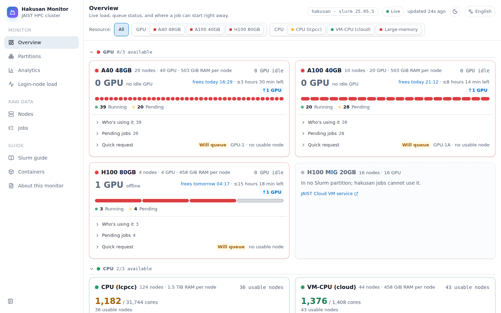
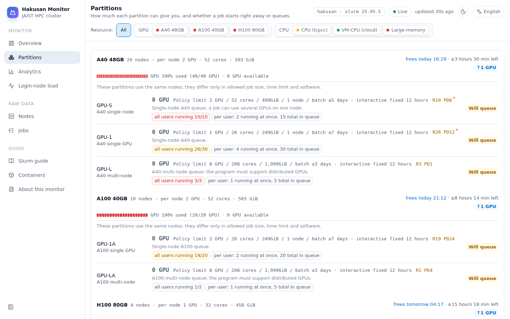
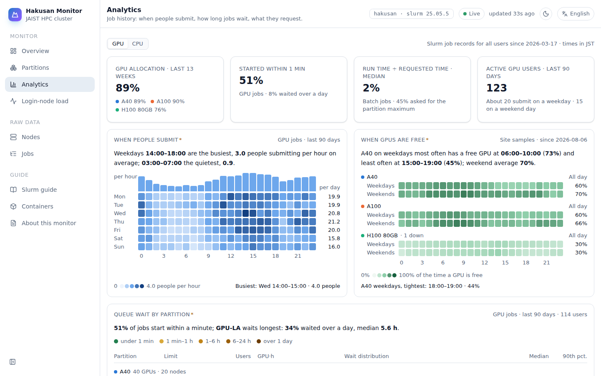
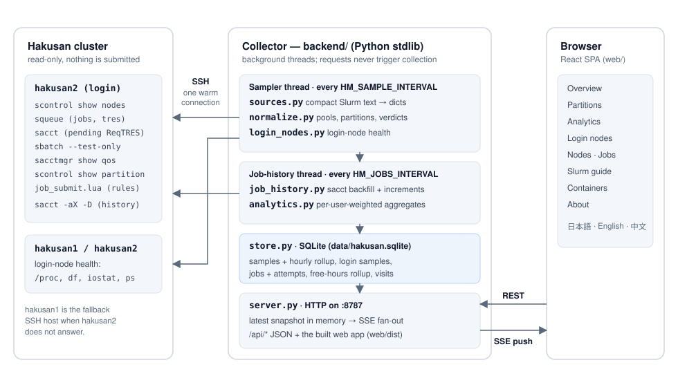

# Hakusan Monitor

A status dashboard for Slurm clusters, built for JAIST's **Hakusan** HPC
cluster. One web page shows how busy the cluster is, where a job can start
right now, why queued jobs wait, and how the cluster is used over time — in
日本語, English and 中文. It runs on any Slurm cluster; see
[Use it on another Slurm cluster](#use-it-on-another-slurm-cluster).

It is read-only and gentle on the login node: one reused SSH connection, compact
Slurm queries, and nothing is ever submitted or cancelled. The backend is pure
Python (standard library only); the frontend is a React app the backend serves.

> Community tool, not an official JAIST service.



## What you can see

| Page | What it answers |
|---|---|
| **Overview** | How full is each hardware pool (A40, A100, H100, CPU, …)? Where can my job start now? Who is using what, and when do GPUs free up? |
| **Partitions** | Per-partition load and queue, limits, and whether the default request starts now — with a copyable `salloc` / `sbatch` command. |
| **Analytics** | From the job history: when people submit, when GPUs or whole nodes are free, queue wait per partition, how much of the requested time jobs use, job shapes, interactive sessions, weekly allocation, active users, outcomes. GPU and CPU views. |
| **Login nodes** | Load, CPU / I/O wait, memory, disk pressure and top processes on hakusan1 / hakusan2. |
| **Nodes**, **Jobs** | Every node and every job in sortable, filterable tables. |
| **Slurm guide**, **Containers** | How to submit on Hakusan, and SingularityCE usage (SIF images, Docker conversion, `--nv`). |

Hakusan's 25 partitions are overlapping views of about 7 physical pools (the 16
CPU partitions all share the same 124 `lcpcc` nodes), so the dashboard leads with
**pools** and reports free cores and free GPUs per pool. Every limit and default
it shows is read from the cluster (QoS, partition config, `job_submit.lua`), not
written into the code.

| Partitions | Analytics |
|---|---|
|  |  |

The CPU view of Analytics asks the same questions of whole nodes:
[screenshot](docs/screenshots/analytics-cpu.png). User names are masked in all
screenshots (`HM_MASK_USERS=1`).

## How it works



- **Sampler thread** — every `HM_SAMPLE_INTERVAL` it reads nodes, queue and
  policy in one SSH round trip (`sources.py`), turns them into pools, partitions
  and verdicts (`normalize.py`), keeps the result in memory, saves it to SQLite
  (`store.py`) and pushes it to every open page over Server-Sent Events.
- **Job-history thread** — reads Slurm accounting with `sacct`
  (`job_history.py`): the full history once, in 30-day chunks, then only the
  latest window. `analytics.py` turns it into the Analytics page, weighting
  every *user* equally so a few accounts with 100k+ jobs don't dominate.
- **HTTP server** (`server.py`) — serves `/api/*` and the built frontend.
  Requests never trigger collection, so pages stay fast even when the cluster
  is slow.
- **Frontend** (`web/`) — React + TypeScript (Vite, Tailwind, shadcn/ui, SVG
  charts, Radix Colors). See [`web/README.md`](web/README.md).

## Load on the cluster

Everything is read-only. One sample serves every viewer — 100 open browsers
still cause one query stream. The refresh button next to the data age asks for
an extra sample; the server allows one per `HM_REFRESH_MIN_INTERVAL` (15 s at
least) however many people click.

| What | How often | Cost |
|---|---|---|
| Nodes, queue, pending jobs' requested totals (`scontrol`, `squeue`, `sacct --state=PENDING`) | `HM_SAMPLE_INTERVAL` (default 300 s) | one SSH round trip, typically 2–5 s |
| CPU start check (`sbatch --test-only`, submits nothing) | `HM_CPU_PROBE_INTERVAL` (900 s) | rides on the same connection |
| Policy: QoS, partitions, `job_submit.lua` | `HM_POLICY_INTERVAL` (24 h) | a few seconds |
| Job history (`sacct -aX`) | `HM_JOBS_INTERVAL` (600 s); first start reads the whole history in chunks, a few minutes | under a second per read |
| Login-node health (`/proc`, `df`, `iostat`, `ps`) | `HM_LOGIN_INTERVAL` (300 s) | one SSH per node, 1–3 s |

The SSH connection is kept warm (`ControlPersist` longer than the sample
interval), and `HM_SSH_HOST` may list fallbacks (`you@hakusan2,you@hakusan1`).

## Try it without a cluster

```bash
cd web && npm install && npm run build && cd ..   # build the web app once
HM_SOURCE=mock python3 backend/server.py          # open http://localhost:8787
```

Mock mode reads `mock/nodes.json`, `mock/squeue.json` and `mock/login_nodes.json`.
They were captured from the live cluster, so they are not in this repository —
supply your own. Analytics stays empty in mock mode: it reads `sacct`.

## Run it against Hakusan

Use a host on the JAIST network that can `ssh` to the login node without a
password prompt. Keep your account out of git by putting it in `.env`:

```bash
cp .env.example .env              # set HM_SSH_HOST=you@hakusan2 (and optionally HM_LOGIN_NODES)
HM_SOURCE=ssh python3 backend/server.py
```

On a machine that has the Slurm commands itself, use `HM_SOURCE=local`.
`scripts/run.sh ssh|local|mock` wraps both.

Set `HM_SITE=sites/hakusan.json` for Hakusan's pool names, GPU memory,
partition order and guide pages.

For an always-on deployment (systemd user service, Docker Compose, a dedicated
SSH key, serving under a path prefix such as `/hakusan/`, daily policy check),
see [`docs/DEPLOY.md`](docs/DEPLOY.md).

## Use it on another Slurm cluster

Point `HM_SSH_HOST` at a login node of your cluster (or use `HM_SOURCE=local` on
a host with the Slurm commands) and leave `HM_SITE` unset. Without a site file:

| What | Where it comes from |
|---|---|
| Cluster name | Slurm's `ClusterName` |
| Hardware pools | GPU nodes grouped by GPU model (gres type); CPU nodes by core count and memory — one shape is just "CPU" |
| GPU names | the gres type, e.g. `nvidia_a100` → A100; memory is not shown |
| Partition order | the order `scontrol show partition` lists them |
| Starter command per pool | Slurm's default partition if it is in the pool, else the pool's first partition |
| Limits | QoS (`sacctmgr`) and partition config (`scontrol`) |
| Containers page | shown when `singularity --version` answers on the login node |
| Slurm guide page | off (it is written for Hakusan) |

It uses only the standard client commands (`scontrol`, `squeue`, `sacct`,
`sacctmgr`) and has been run on Slurm 25.05. Analytics needs `sacct` with a
`PrivateData` setting that lets users see all jobs.

### Site file

A JSON file named by `HM_SITE` overrides any of these. Every key is optional;
[`sites/hakusan.json`](sites/hakusan.json) is a complete example.

```json
{
  "name": "Mycluster",
  "org": "Example University",
  "links": { "home": "https://hpc.example.edu/" },
  "job_submit_lua": "/etc/slurm/job_submit.lua",
  "pools": [
    { "id": "a100", "nodes": "^gpu-a", "label": "A100", "sample_partition": "gpu" },
    { "id": "cpu", "nodes": "^cn", "label": { "en": "CPU", "ja": "CPU", "zh": "CPU" } }
  ],
  "gpus": { "nvidia_a100": { "label": "A100", "mem_gb": 80 } },
  "partition_order": ["gpu", "short", "long"],
  "strings": { "en": { "app.subtitle": "Example University HPC" } }
}
```

| Key | Meaning |
|---|---|
| `name`, `cluster`, `org` | display name, cluster name, and the organisation named in the footer note |
| `links.home`, `links.outside_hardware` | footer link; link on hardware that no partition schedules |
| `job_submit_lua` | path of the submit plugin on the cluster, for its defaults (`HM_JOB_SUBMIT_LUA` wins) |
| `pools` | in display order; `nodes` is a regular expression on the node name, the first match wins; nodes no rule matches are grouped automatically |
| `gpus` | label and memory per gres type, in display order |
| `partition_order`, `cpu_probe_order` | partition display order; order of the CPU start checks |
| `pages.slurm_guide` | show the Slurm guide page |
| `strings` | any UI string, per language (`en`, `zh`, `ja`); keys are in `web/src/i18n/en.ts`. Partition titles are `policy.<name>` and `policy.<name>.desc`, pool descriptions `pooldesc.<pool id>` |

Pool ids are stored with the history, so pick them once and keep them.

## Develop and test

```bash
python3 -m unittest discover -s tests   # backend
cd web
npm run dev      # http://localhost:5173, proxies /api to :8787 (run the backend too)
npm test         # Vitest
npm run lint     # oxlint
npm run build    # → web/dist, which the backend serves
```

## Configuration

Set these in the environment or in `.env`.

| Variable | Default | Meaning |
|---|---|---|
| `HM_SOURCE` | `mock` | `ssh`, `local` or `mock` |
| `HM_SSH_HOST` | — | SSH target(s), e.g. `you@hakusan2,you@hakusan1` |
| `HM_SSH_OPTS` | keep-alive defaults | extra `ssh` options (key, ControlMaster) |
| `HM_PORT` | `8787` | listen port |
| `HM_SAMPLE_INTERVAL` | `300` | seconds between cluster samples |
| `HM_SOURCE_TIMEOUT` | `75` | seconds before a sample gives up |
| `HM_REFRESH_MIN_INTERVAL` | `15` | seconds between two "refresh now" samples, for all viewers together (never below 15) |
| `HM_CPU_PROBE_INTERVAL` | `900` | seconds between CPU start checks |
| `HM_POLICY_INTERVAL` | `86400` | seconds between policy reads |
| `HM_SITE` | — | site file, e.g. `sites/hakusan.json` (relative to the repository) |
| `HM_JOB_SUBMIT_LUA` | the site file's `job_submit_lua` | where the submit plugin lives on the cluster; empty = not read |
| `HM_LOGIN_NODES` | — | login nodes to watch, e.g. `hakusan1=you@hakusan1,hakusan2=you@hakusan2` |
| `HM_LOGIN_INTERVAL` | `HM_SAMPLE_INTERVAL` | seconds between login-node samples |
| `HM_LOGIN_TIMEOUT` | `25` | seconds per login-node read |
| `HM_LOGIN_TOP_N` | `12` | top processes / users kept per node |
| `HM_LOGIN_SHOW_ARGS` | `0` | `1` shows (truncated) command arguments |
| `HM_JOBS_INTERVAL` | `600` | seconds between job-history reads |
| `HM_JOBS_RETAIN_DAYS` | `400` | days of job history kept (and read on first start) |
| `HM_ANALYTICS_INTERVAL` | `1800` | seconds between Analytics recomputations |
| `HM_DB` | `data/hakusan.sqlite` | database file |
| `HM_RETAIN_DAYS` | `60` | days of sample timestamps kept (they make recording idempotent); the hourly free-capacity rollup behind Analytics is kept indefinitely |
| `HM_LOGIN_RETAIN_DAYS` | `HM_RETAIN_DAYS` | days of login-node samples kept |
| `HM_VISIT_RETAIN_DAYS` | `365` | days of anonymous visit counts kept |
| `HM_CLUSTER_TZ` | `Asia/Tokyo` | time zone Slurm prints times in |
| `HM_MASK_USERS` | `0` | `1` hides user names in the public view |
| `HM_MAX_SSE` | `64` | maximum live connections |
| `HM_PUBLIC_URL` | — | redirect page requests that reach the port directly to this URL |
| `HM_TRUST_PROXY` | `0` | `1` trusts `X-Forwarded-For` (only behind your own proxy) |
| `HM_ACCESS_LOG` | `0` | `1` logs every HTTP request |
| `HM_FRONTEND` | `web/dist` | built web app to serve |

## API

| Endpoint | Returns |
|---|---|
| `GET /api/snapshot` | the current cluster snapshot (versioned JSON) |
| `GET /api/stream` | Server-Sent Events: a new snapshot after every sample |
| `GET /api/analytics` | job-history aggregates for the Analytics page (GPU and CPU views) |
| `GET /api/login-nodes` | current login-node health |
| `GET /api/login-nodes/history?hours=24` | login-node history |
| `GET /api/policy-source` | the raw policy texts (`job_submit.lua`, QoS, partitions), their reading and the last daily check |
| `GET /api/visits?days=30` | anonymous daily visitor counts for the project page |
| `GET /api/meta` | cluster name, Slurm version, partitions, container info |
| `GET /api/site` | site name, links, page switches, partition order, cluster time zone and site strings |
| `GET /api/health` | liveness, data source, data age, and the last database error (`store_error`) |
| `POST /api/refresh` | ask for a sample now: 202 when one is started or queued, 429 with `retry_after` within `HM_REFRESH_MIN_INTERVAL` of the last one |

## Data and privacy

- Any Hakusan user can already see everyone's jobs with `squeue` / `sacct`;
  `HM_MASK_USERS=1` still hides user names on the public page.
- The job history stores user names only as installation-keyed hashes, and a
  job's submit line only as its first word (`sbatch`, `salloc`, `srun`) — script
  names and paths never leave the cluster.
- Analytics needs a cluster whose `PrivateData` setting lets users see all jobs
  (`sacct -a`), as Hakusan's does.
- `HM_MASK_USERS=1` shortens names to their first two letters (`ab***`); the
  screenshots above were taken that way.

## Repository layout

```
backend/   server.py · sources.py · normalize.py · site_config.py · store.py ·
           job_history.py · analytics.py · login_nodes.py · lua_policy.py
sites/     site files (hakusan.json)
web/       React frontend (see web/README.md)
tests/     backend unit tests
scripts/   run.sh, cluster policy check, GPU memory probe, queue fixture capture
deploy/    systemd units
docs/      design (DESIGN.md), deployment (DEPLOY.md), architecture.svg, screenshots/
```
